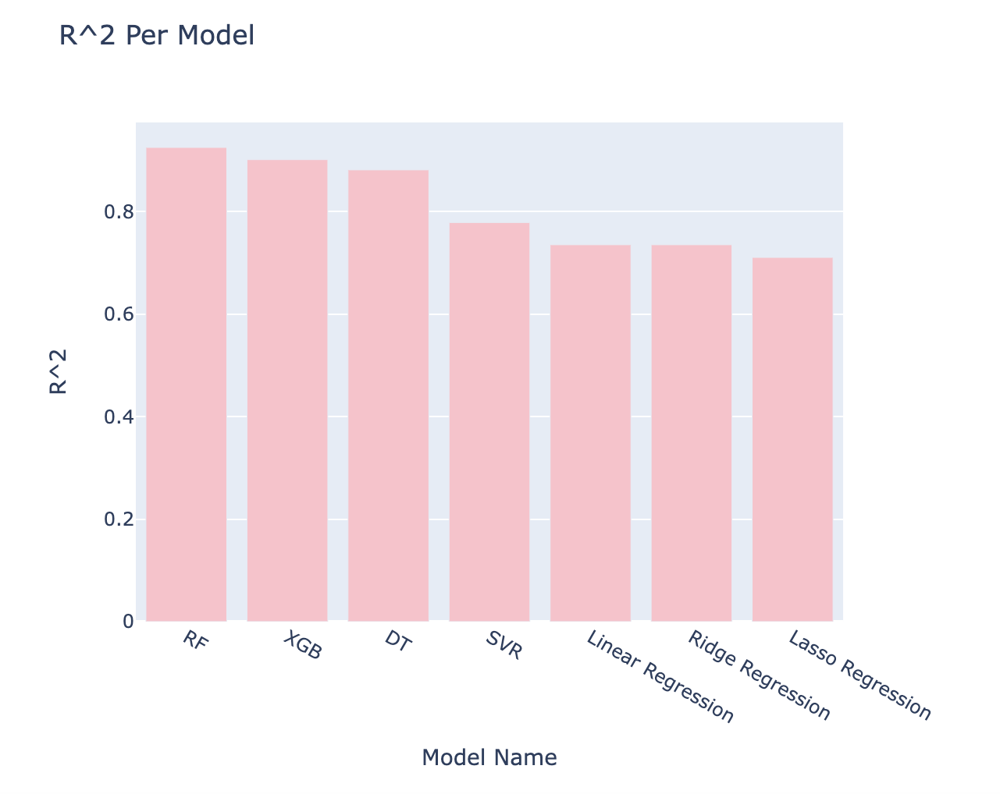
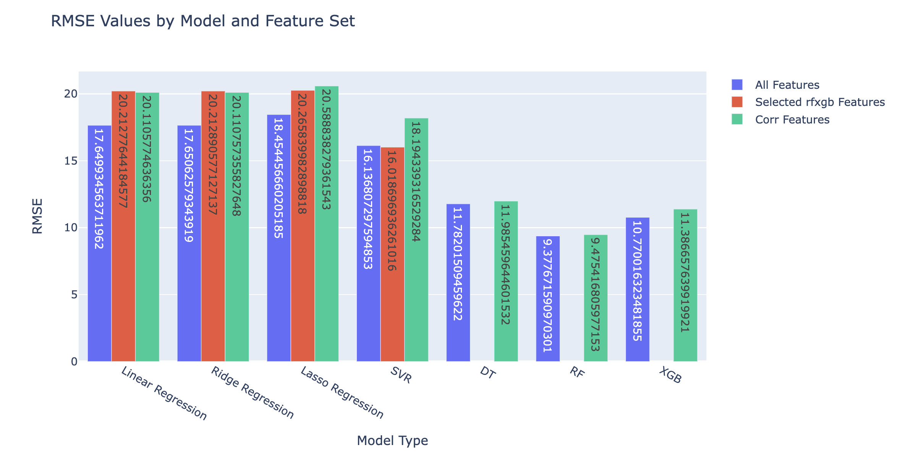

# SuperconductorRegressionAnalysis


Access the full colab notebook [here](https://colab.research.google.com/drive/1rvXt8XBbyUkSVo73d0YCBkaSmE9ebSRx?usp=sharing) for all code and in-depth explanations. 

## Table of Contents:
- [Project Objective](#project-objective)
- [Project Outcomes](#project-outcomes)
- [Background Information](#background-information)
- [Understanding the Data](#understanding-the-data)
- [Feature Selection](#feature-selection)
- [Non-Neural Network Models](#non-neural-network-models)
- [Neural Network Models](#neural-network-models)
- [Conclusions](#conclusions)

## Project Objective
The objectives of this project are to:
- Create a model that best predicts the critical temperature of a superconductor based on its material properties
- Compare model performance based on evaluation metrics
- Determine which features are most important in determining critical temperatures

## Project Outcomes 
- Developed a Random Forest model that predicted the critical temperature of a superconductor with root mean square error of 9.41 and R^2 value of 0.92
- Found a subset of [13 of 81](https://htmlpreview.github.io/?https://github.com/anushkarao5/SuperconductorRegressionAnalysis/blob/main/MoreInfo/significant_features.html) features whose variance explained a minimum of 65% of the variability in the target variable for all non tree-based models
- Found a subset of [25 of 81](https://htmlpreview.github.io/?https://github.com/anushkarao5/SuperconductorRegressionAnalysis/blob/main/MoreInfo/significant_features.html)
features whose variance explained a minimum of 65% of the variability in the target variable for all non-neural network models

## Background Information

&nbsp;&nbsp;&nbsp;&nbsp;&nbsp;&nbsp;Superconductors are a unique class of materials that efficiently conduct electricity without electrical resistance or heat loss. When an electrical current is passed through conventional materials, some of the flowing electrons collide with the atoms in the material, creating resistance. This resistance leads to dissipation of energy as heat.

&nbsp;&nbsp;&nbsp;&nbsp;&nbsp;&nbsp;However, when an electrical current is sent through a superconductor, no collisions or resistance occurs. The electrons flow smoothly through the material, so no energy is lost as heat. This property of zero resistance makes superconductors highly desirable in areas like power transmission and distribution.

&nbsp;&nbsp;&nbsp;&nbsp;&nbsp;&nbsp;Superconductors also display interesting relationships with magnetic fields. Type 1 superconductors repel outside magnetic fields by creating a shield that prevents exterior magnetic lines from entering (Meissner Effect). When a magnet is placed atop a Type 1 superconductor, the magnet will hover in the air because the superconductor’s force field repels the magnet’s magnetic field. This is how hoverboards and levitating (Maglev) trains work!

<p align="center">
  
</p>


&nbsp;&nbsp;&nbsp;&nbsp;&nbsp;&nbsp;Type 2 superconductors allow some magnetic fields into their shields without losing their superconducting properties. MRI machines require strong magnetic fields to create high-quality images. Since Type 2 superconductors allow the controlled entry of magnetic fields, they are ideal for creating the magnetic fields needed for MRIs.

&nbsp;&nbsp;&nbsp;&nbsp;&nbsp;&nbsp;What’s the catch?

&nbsp;&nbsp;&nbsp;&nbsp;&nbsp;&nbsp;Superconductors require extremely low temperatures to reach their superconducting state. The temperature at which a material enters its superconductive state is the critical temperature. For some reference, the highest temperature superconductor (as of now) is a hydrogen sulfide compound which exhibits superconductivity only at -70 degrees Celsius! Since superconductors require extremely low temperatures, readily applying them in technology is challenging. Much of the current research in the field focuses on discovering superconductors at higher temperatures.

## Understanding the Data
- This data was taken from [UC Irvine's machine learning repository](https://archive.ics.uci.edu/dataset/464/superconductivty+data).
- The superconductor data set contains 21263 superconducting materials.
- There are 81 features representing the material properties of the superconductors. These 81 features are variations of 9 main features: number of elements, atomic mass,  first ionization energy, atomic radius, density, electron affinity, fusion heat, thermal conductivity, and valence. Click [here](https://htmlpreview.github.io/?https://github.com/anushkarao5/SuperconductorRegressionAnalysis/blob/main/MoreInfo/feature_breakdown.html) for a brief introduction to these features.


The target variable is the critical temperature:

<p align="center">
  
</p>

- Many materials have critical temperatures between 0 and 25 Kelvin ( -459.67°F to -414.67°F). Another group of materials has critical temperatures between 65 and 95 Kelvin (-337.67°F to -297.67°F). Naturally, the materials in the second group are easier to use because they require higher temperatures. Still, -300°F is far from room temperature (~ 70°F). Even the higher temperature superconductors only enter their superconductive state at 140 K (-207°F). Keeping superconductors at or below their extremely low critical temperatures presents a significant challenge when working with these materials. 


## Feature Selection
When feeding data into our models, we must decide which features are relevant. There are several ways to do this. We examine four techniques of feature selection. 
1) Using all 81 features (baseline metric) 
2) Using only the features that have correlation coefficients with the target variable of over 0.5 
3) Using Principal Component Analysis 
4) For our non-treebased models, using the most important features determined by the RF and XGB algorithm (more on this later)

## Non Neural Network Models

We consider these regression models: 
- Linear Regression 
- Ridge Regression 
- Support Vector Regression 
- Decision Tree Regression 
- Random Forest Regression 
- XGB Regression


&nbsp;&nbsp;&nbsp;&nbsp;&nbsp;&nbsp;We look for a model and feature selection technique that optimizes our evaluation metrics (minimizes RMSE and maximizes R^2). For more information on both the models and the evaluation metrics, click [here](https://htmlpreview.github.io/?https://github.com/anushkarao5/SuperconductorRegressionAnalysis/blob/main/MoreInfo/models_and_metrics.html).

&nbsp;&nbsp;&nbsp;&nbsp;&nbsp;&nbsp;Before we begin modeling, we create simple pipelines that scale all input features for every model. Feature scaling ensures that all features have similar magnitudes, which prevents certain features (features with larger magnitudes) from dominating the training process.


```python
scaled_pipelines = {
    'Lin reg scaled': Pipeline([
        ('scaler', StandardScaler()),
        ('Linear Regression', LinearRegression())
    ]),
    'Ridge reg scaled': Pipeline([
        ('scaler', StandardScaler()),
        ('Ridge Regression', Ridge(max_iter=10000))
    ]),
    'Lasso reg scaled': Pipeline([
        ('scaler', StandardScaler()),
        ('Lasso Regression', Lasso(max_iter=10000))
    ]),
    'SVR scaled': Pipeline([
        ('scaler', StandardScaler()),
        ('Support Vector Regressor', SVR())
    ]),
    'DT scaled': Pipeline([
        ('scaler', StandardScaler()),
        ('Decision Tree', DTR())
    ]),
    'RF scaled': Pipeline([
        ('scaler', StandardScaler()),
        ('Random Forest', RFR())
    ]),
    'XGB scaled': Pipeline([
        ('scaler', StandardScaler()),
        ('XGB', XGB.XGBRegressor(random_state=42))
    ]),
}
```

- Since we are trying to optimize the evaluation metrics, we must first find the best versions of each model type before comparing the tuned models. To find the best version of each model type, we must find the combination of hyperparameters that result in the best performance for a particular model type. We then save the best estimator for each model type and compare which of the tuned model types yields the lowest RMSE and the highest R^2.
  
- We use GridSearchCV to exhaustively check all hyperparameter combinations for a particular model. The hyperparameters we use come from this parameter grid: 


```python
param_grid = {
    'Lin reg': {},
    'Ridge reg': {'Ridge Regression__alpha': [0.1, 1.0]},
    'Lasso reg': {'Lasso Regression__alpha': [0.1, 1.0]},
    'SVR': {
        'Support Vector Regressor__C': [0.1, 1.0],
        'Support Vector Regressor__kernel': ['linear', 'rbf']
    },
    'DT': {'Decision Tree__max_depth': [None, 10]},
    'RF': {
        'Random Forest__n_estimators': [100],
        'Random Forest__max_depth': [None, 10]
    },
    'XGB': {
        'XGB__n_estimators': [100, 200],
        'XGB__learning_rate': [0.01, 0.1],
        'XGB__max_depth': [3, 4],
        'XGB__min_child_weight': [1, 3],
        'XGB__subsample': [0.8, 0.9],
        'XGB__colsample_bytree': [0.8, 0.9],
        'XGB__gamma': [0, 0.1]
    }
}
```

- Using a for loop with GridSearchCV, we save the best estimators for each model type in the best estimator list. We then compare the tuned estimators for each of the model types.
  
In simple terms, we are: 
1) Comparing many versions of the same model type (ex: linear regression)
2) Comparing the best version of each model type (ex: best linear regression, best ridge, best lasso, ect)

To learn more about the parameter grid and GridSearchCV, click [here](https://htmlpreview.github.io/?https://github.com/anushkarao5/SuperconductorRegressionAnalysis/blob/main/MoreInfo/param_grids_and_gscv%202.html).
### Using All Features 

<p align="center">
  
</p>

<p align="center">
  
</p>

Results for non-NN models using all features: 
- As we can see, the RF algorithm performs best (RMSE= 9.41 and R^2=0.92) 
- The XGB algorithm is a close second (RMSE = 10.74 and R^2= 0.90). 
- Using all features, RF and XGB perform best: tree-based models are well equipped to handle multicollinearity, nonlinearity, and high dimensionality
- Our linear models performed the worst using all 81 variables. This was largely due to the high multicollinearity between the variables.
- Click [here](https://htmlpreview.github.io/?https://github.com/anushkarao5/SuperconductorRegressionAnalysis/blob/main/MoreInfo/non_nn_performance.html#non-neural-network-models) for a more detailed breakdown.

### Using RF and XGB Feature Selection 
- After running the RF and XGB models using all our data, we used the feature importance scores built into both algorithms to determine which features were most important in predicting the critical temperature. Instead of inputting all 81 variables, we used only the top 10 most important features from RF and XGB. After accounting for overlap, we found 13 RFXGB features to plug into our linear models.

<p align="center">
  
</p>

- The thirteen features:
'wtd_std_Valence',
 'wtd_mean_ThermalConductivity',
 'std_atomic_mass',
 'wtd_std_ElectronAffinity',
 'std_Density',
 'wtd_entropy_ThermalConductivity',
 'range_atomic_radius',
 'gmean_ElectronAffinity',
 'range_ThermalConductivity',
 'wtd_gmean_Valence',
 'mean_Density',
 'wtd_mean_Valence',
 'wtd_gmean_ThermalConductivity'

<p align="center">
  
</p>


- Using the reduced set of 13 features, the RMSE scores went up 2-3 points in the non-tree-based models, likely due to a loss of information. However, we must also look at the R^2 metric, which is perhaps more interesting in this case.
- From the previous iteration, variation in all 81 features accounted for 70% of the variation in critical temperature for the non-tree-based models. In comparison, variations in these 13 features accounted for a minimum of 65% of the variation in the critical temperature for the same models. 
- This means that variation in 60 features resulted in only 5% of the variation in our target variable!
- Using RF and XGB, we found a subset of 13 features that are most important in predicting the critical temperature.


### Using Correlation Coefficient Feature selection 
- We next incorporated the 25 features that had a correlation coefficient magnitude of greater than 0.5 with the target variable (critical temperature).
- Using these 25 features, the RMSE scores decreased only slightly compared to the RMSE scores using the 13 RFXGB-selected features.
- Moreover, the R^2 values are almost identical when using the 13 RFXGB and 25 selected correlation features.
- Since the change in RMSE and R^2 values is negligible when switching from 13 features to 25 features, we should use the RFXGB features to create our model. Using these 13 features helps us create a less complex and more interpretable model.


<p align="center">
  
</p>

<p align="center">
  
</p>


### Using Principal Component Analysis 
- Principal component analysis (PCA) is a dimensionality technique used to transform a large number of correlated features into a lower-dimensional set of uncorrelated features. The goal is to reduce the number of features while retaining the most information.
- Note that PCA is used primarily in linear regression models to deal with multicollinearity. We do not expect this technique to perform well on models that are equipped to handle non-linear data or highly correlated data in a large feature space. Click here for more info on PCA. 
- For our model, we used the first 16 principal components (PCs). These 16 PCs explain 95% of the variation in the target variable. Note that we could have used less PCs, as after PC5, the additional explained variance in the target variable was less than 5%.


 <p align="center">
  
</p>

Of all our input feature sets, PCA resulted in the worst performance.

<p align="center">
  
</p>

<p align="center">
  
</p>

- Unsurprisingly, PCA increased the RMSE and decreased the R^2 value for the non-linear models. Since SVR and tree-based models are known for their capabilities to handle large feature numbers and multicollinearity relatively well, reducing the number of features could have led to information loss. 
- PCA often improves scores in linear models. Why did our linear model scores become less optimal?
- Given how well our non-linear models fit the data, we have a strong assumption that the features are not linearly related to the target variable. PCA does not change the linear assumption between features and target variables. It only transforms the original data set to a new data set of linearly uncorrelated features. However, if the relationship between the features and target variables is nonlinear, most models that have a linear assumption will not perform well.


## Neural Network Models
- Next we explored how neural networks impact our performance. We explore three popular neural networks: a simple feed-forward neural network, a convolutional neural network, and a long short-term memory neural network. Note that we use extremely basic versions of these neural networks. For more information on how these networks work, click [here](https://htmlpreview.github.io/?https://github.com/anushkarao5/SuperconductorRegressionAnalysis/blob/main/MoreInfo/nn_model_performance%202.html).

<p align="center">
  
</p>

Why did the LSTM model perform significantly worse?
- LSTM models assume that there are temporal dependencies in the data. This means that events at one point in time are related to events at a later point in time. Let us consider this in terms of our LSTM model. The LSTM layer looks at the 81 features of a particular layer and considers each of these features to be its own time steps. This assumption is obviously flawed because the 81st feature did not occur before the first feature. Moreover, the LSTM model assumes that features that occur later on (for example the 75th features) are related to the values of the features that occurred earlier on (like the 10th feature).
- However, since we are dealing only with a set of numbers for a particular observation, this is likely not the case. The values for each feature are not necessarily related to the values of previous features.

Why did the SNN and CNN perform better? 
- Feedforward simple neural networks are capable of capturing non-linear relationships between input and target variables. Based on the poor linear regression scores, it is very likely that the relationship between the input and output variables is not linear. SNNs are able to work with nonlinear data.
-  CNNs have many similar benefits. Moreover, using both convolutional layers and pooling operations, CNNs are able to build hierarchies of features. These ranked features can help the model understand the relationships between the input variables and the target variables.
-  CNNs can learn local patterns by sliding over the data in windows. This may help the model understand how features relate to one another.
-  For a more detailed breakdown, click [here](https://htmlpreview.github.io/?https://github.com/anushkarao5/SuperconductorRegressionAnalysis/blob/main/MoreInfo/nn_model_performance%202.html). 


## Conclusions 

### Feature Importance 
- Using the random forest and XGBoost feature selection attribute, we found 13 of 81 features whose variance explained a minimum of 65% of the variance in the target variables for non NN models. This could be important when predicting the critical temperature of new materials.
- The below 13 of 81 features are responsible for 65% of the variability in the target variable for the non-tree-based models.


<p align="center">
  
</p>

- Click here for the 25 of 81 features responsible for 65% of the variability in the target variable for all models. 

### Best Models 

<p align="center">
  
</p>

<p align="center">
  
</p>

- Given how poorly the linear regression models performed, it is likely that the relationship between the input and target variables is not linear.
- Tree based models, in particular Random Forest and XGBoost, using all features performed best due to their ability to handle high dimensional data. In contrast to linear models, tree based models can handle multicollinearity by creating hierarchies of dependencies between features. This is important given how highly correlated our data is.
- Using only a few layers, our SNN and CNN models were able to perform within 2 points RMSE of our tree based models.

**Overall, our best models were Random Forest, XGBoost, CNNs and SNNs.**

It is important to remember that the results of each model were based on a specific set of hyperparameters. The order of model performance could completely change with different hyperparameters! Still, these examples still provide intuition behind how each model approaches regression problems.


